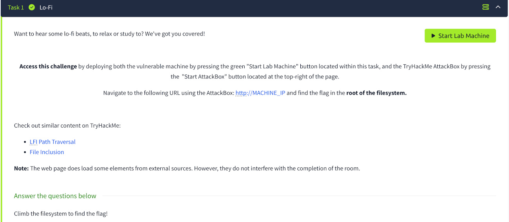
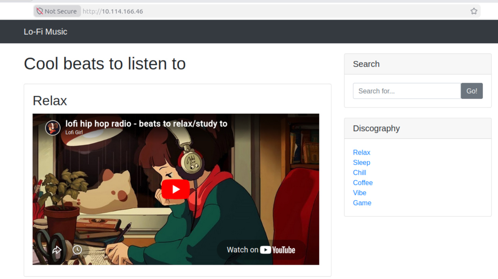

# Lo-Fi

## Цель
Изучение уязвимости Local File Inclusion (LFI) и способов получения доступа к файлам на сервере через некорректную обработку пользовательского ввода.
Уязвимость LFI относится к категории уязвимостей системы контроля доступа (Broken Access Control). 
Она занимает первое место в категории «Нарушение системы контроля доступа» в рейтинге OWASP Top 10. 

## Инструменты
Веб-браузер

## Прохождение задания

В веб-браузере переходим по адресу `http://TARGET_IP`

