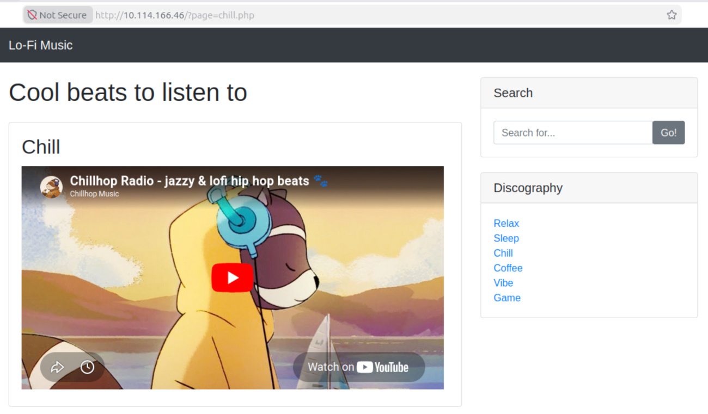
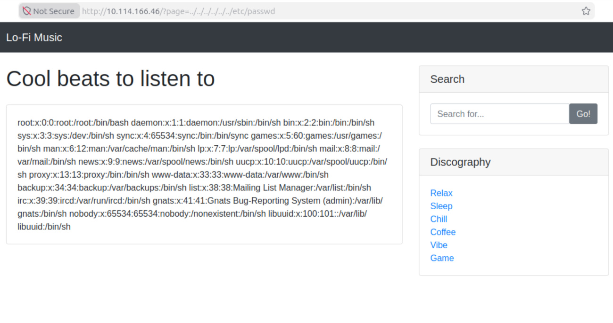

# Lo-Fi
**Категория:** Web Security

**Сложность:** Easy

## Цель
Изучение уязвимости Local File Inclusion (LFI) и способов получения доступа к файлам на сервере через некорректную обработку пользовательского ввода.
Уязвимость LFI относится к категории уязвимостей системы контроля доступа (Broken Access Control). 
Она занимает первое место в категории «Нарушение системы контроля доступа» в рейтинге OWASP Top 10. 

## Инструменты
Веб-браузер

## Прохождение задания

В веб-браузере переходим по адресу `http://TARGET_IP`

При переходе по хоступным ссылкам в правой части страницы, замечаем, контент страниц загружается через параметр URL.
Например, `?page=chill.php`

Подобная реализация часто использует функции чтения файлов на стороне сервера и требует проверки на возможность обхода каталогов.
Возникает предположение о возможности управления путём к файлу через пользовательский ввод. Для ее проверки попробуем прочитать файл **/etc/passwd/** путем последовательного перехода по каталогам. Для этого в адресной строке браузера водим: **../../../../etc/passwd**.

Получаем данные из файла **/etc/passwd**

