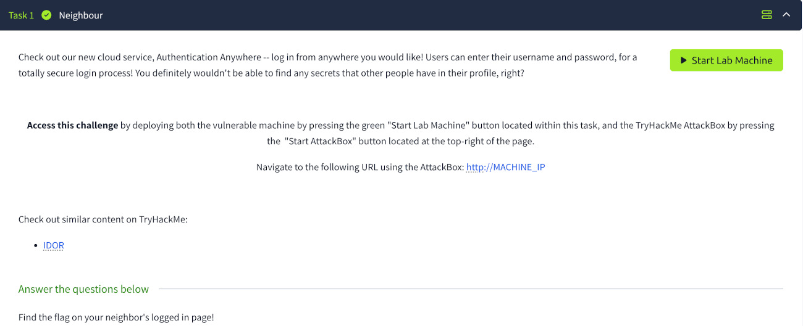
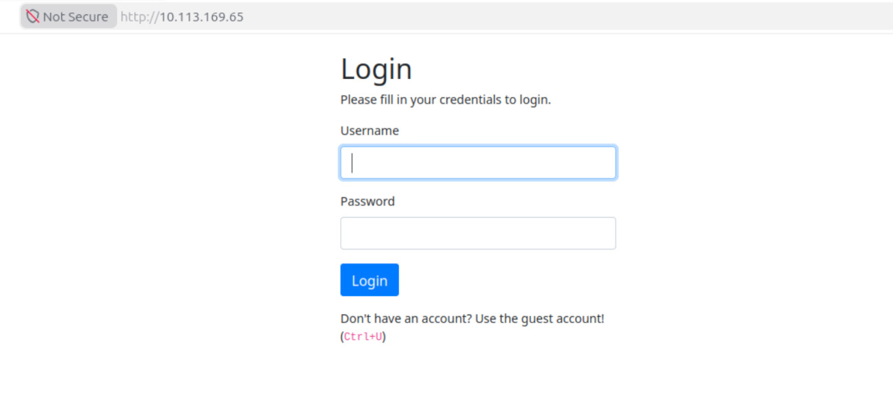
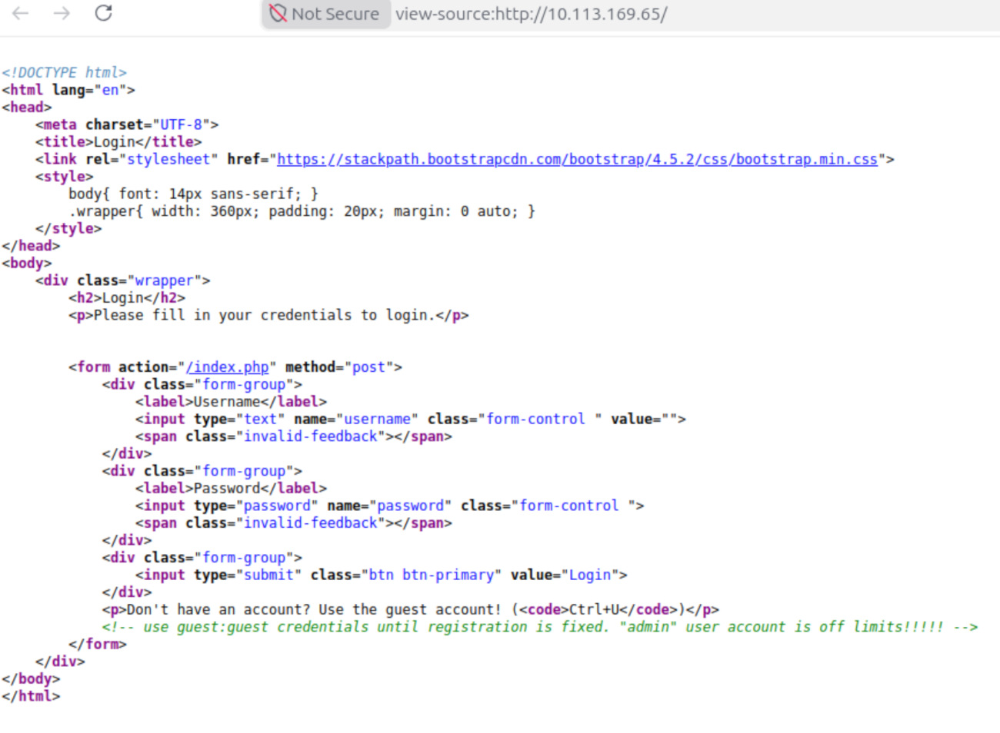
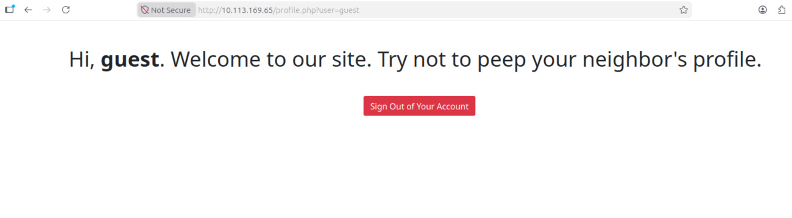
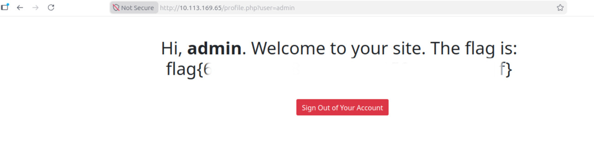

# Neighbour
**Категория:** Web Security

**Сложность:** Easy


## Цель
Ознакомится с уязвимостью типа **Insecure Direct Object Reference(IDOR)**.
Уязвимость IDOR относится к категории уязвимостей системы контроля доступа (**Broken Access Control**). 
Она занимает первое место в категории «Нарушение системы контроля доступа» в рейтинге OWASP Top 10. 


## Инструменты
Веб-браузер

## Прохождение задания

В веб-браузере переходим по адресу `http://TARGET_IP`
Видим панель для авторизации. 


Просмотрев исходный код (Ctrl+U) узнаем данные для входа, а также узнаем, что есть юзер с ником `admin` у 
которого нет ограничений. 



После авторизации на сайте в адресной строке браузера видим структуру
```/profile?user=guest``` 



Возникает предположение, что сервер недостаточно проверяет принадлежность объекта текущему пользователю.
Проведено это предположение путем изменения идентификатора пользователя 'guest' на `admin` в запросе.

## Результат:

* приложение отобразило данные другого пользователя;
* сервер не выполнил проверку авторизации для запрашиваемого объекта. 




## Выводы

Обнаружена классическая уязвимость типа **IDOR (Insecure Direct Object Reference)**.
Суть проблемы:
* объект идентифицируется предсказуемым параметром;
* отсутствует серверная проверка прав доступа;
* пользователь может получать информацию о чужих объектах.

#### Возможные последствия
* раскрытие данных пользователей;
* получение конфиденциальной информации;
* горизонтальное и вертикальное повышение привилегий.

#### Классификация
* **OWASP TOP 10**
* [A01:2021 — Broken Access Control](https://owasp.org/Top10/2021/A01_2021-Broken_Access_Control/)
* **CWE**
* [CWE-639 — Authorization Bypass Through User-Controlled Key](https://cwe.mitre.org/data/definitions/639.html)
* [CWE-862 — Missing Authorization](https://cwe.mitre.org/data/definitions/862.html)
* **MITRE ATT&CK**
* **Tactic** [T1213 — Data from Information Repositories](https://attack.mitre.org/techniques/T1213/)

#### Рекомендации по защите
* выполнять проверку доступа на серверной стороне;
* использовать объектную авторизацию;
* не полагаться на скрытие идентификаторов;
* применять принцип Least Privilege.
#### Полученные навыки
* анализ веб-приложений;
* тестирование контроля доступа;
* выявление IDOR-уязвимостей;
* работа с параметрами HTTP-запросов.

